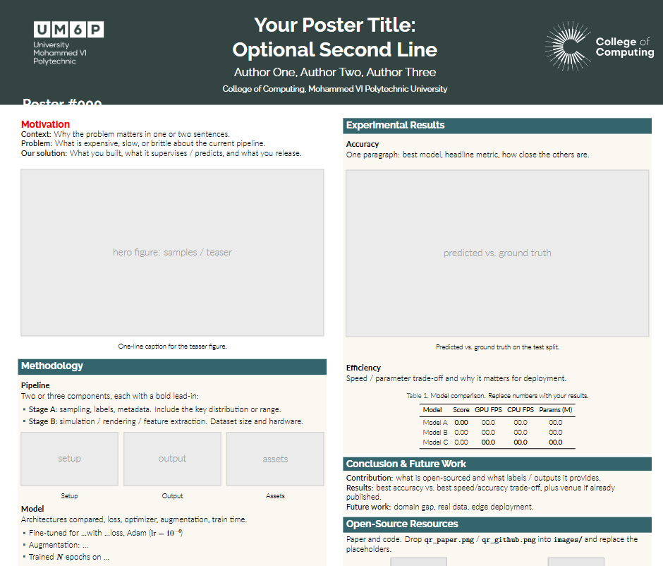

# Beamerposter template

Gemini theme with the UM6P header/footer colors used for the CVPR 2025 SynData4CV poster. Clone this folder, edit metadata, replace the gray placeholders, and compile with LuaLaTeX.

Compiled skeleton: [poster.pdf](poster.pdf)

## Preview

<p align="center">
  
</p>

## Layout

```
poster.pdf                 compiled skeleton (tracked in git)
poster.tex                 fill-in skeleton (2-column A0)
config.tex                 title, authors, poster number, footer
preamble.tex               gemini theme, UM6P colors, column widths, placeholders
beamerthemegemini.sty      Gemini theme (MIT)
beamercolorthemeum6p.sty   dark-gray header, teal blocks, cream body
beamercolorthemenott.sty   original Gemini/Nottingham theme (optional)
images/                    UM6P logos; drop figures and QR codes here
preview/                   README screenshot
example/                   the original CVPR 2025 poster (source + compiled PDF)
```

## New poster

```bash
cp -r poster_tex_template ~/tex/my_new_poster
cd ~/tex/my_new_poster
```

1. Edit `config.tex` (title, authors, `PosterNumber`, footer line).
2. Drop figures into `images/` and replace `\placeholderfig{...}` / `\placeholderqr{...}` with `\includegraphics`.
3. Rewrite the block text. Left column is motivation + method; right column is results + conclusion + QR codes.
4. Compile with **LuaLaTeX** (pdfLaTeX will fail: Gemini uses `fontspec`):

```bash
latexmk poster.tex
# or: make
```

In Cursor / VS Code, `poster.tex` has a `% !TEX program = lualatex` magic comment so LaTeX Workshop should pick LuaLaTeX. If the Build button still uses pdfLaTeX, run the command above in a terminal instead.

Needs TeX Live with Beamer, `beamerposter`, `fontspec`, and LuaLaTeX. Gemini prefers Raleway / Lato and falls back to TeX Gyre fonts if those are missing.

Paper size and scale are set in `preamble.tex`:

```latex
\usepackage[orientation=portrait,size=a0,scale=1.15]{beamerposter}
```

For three columns, change the lengths so `(N+1)*\sepwidth + N*\colwidth = \paperwidth`. Example: `\sepwidth=0.025\paperwidth` and `\colwidth=0.30\paperwidth`.

## Blocks included

| Block | Role |
| --- | --- |
| Alert (motivation) | Context / problem / solution |
| Hero figure | Full-width teaser |
| Methodology | `\heading` + itemize + 3-image row |
| Results | Plot + `booktabs` table |
| Conclusion | Contribution / results / future work |
| QR row | Paper + code |
| Header / footer | Logos, poster number overlay, venue line |

## Example

`example/poster.tex` is the current CVPR 2025 SynData4CV poster. Compile it from `example/`:

```bash
cd example
latexmk poster.tex
```

The compiled PDF is already there as `example/poster.pdf`.

Gemini theme license: MIT (see `LICENSE.md`).
